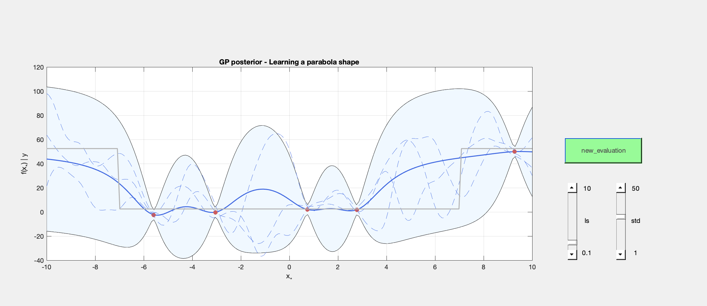

Interactive Gaussian process (GP) tool
======================================
With this interactive tool, one can directly see the impact of hyperparameter changes on a one-dimensional Gaussian process (GP) regression model. This simple tool is designed for newcomers to gain understanding about GPs with a simple example.


The tool builds on top of the [GPML library](http://www.gaussianprocess.org/gpml/code/matlab/doc/) and provides insight on two different covariance functions: Squared exponential (SE) and rational quadratic (RQ). See [this nice post from David Duvenaud](https://www.cs.toronto.edu/~duvenaud/cookbook/) for a brief description of the SE and RQ covariance functions, and see [Gaussian Processes for Machine Learning, Section 4.2 for a detailed overview of popular covariance functions](http://www.gaussianprocess.org/gpml/chapters/).

This tool was designed and tested on MATLAB R2017a.

Running the code
================
Run the following script before starting the application to load the [GPML library](http://www.gaussianprocess.org/gpml/code/matlab/doc/)
```Matlab
start_up
```

Run the script `run_interactiveGP_SE.m` for using the SE covariance function and `run_interactiveGP_RQ.m` for using the RQ covariance function.
```Matlab
run_interactiveGP_SE
```

A window should pop up, like the one in the image above. Move the `ls` slider to modify the lengthscale and the `std` slider to modify the prior standard deviation of the covariance function. Click on the button `new_evaluation` to generate a new evaluation at a random location.

### Legend
The true function is depicted as a solid gray line. The posterior GP men is depicted as a solid blue line, and the blue surface indicates the posterior standard deviation. The dashed lines indicate three random samples of the posterior GP, i.e., three random possible functions that the GP model encodes.

The model noise is fixed, but can be changed manually in `utils/initialize_GP.m`, line 51.

The underlying function that the GP learns is a discontinuity, i.e., a challenging function for these type of covariance functions, which typically assume smooth functions.

For seeing the example with the RQ covariance function, type
```Matlab
run_interactiveGP_RQ
```

This example includes an additional parameter `alpha`, that controls the "roughness" with which the model estimates the function. See how lower values achieve a smoother function fitting.